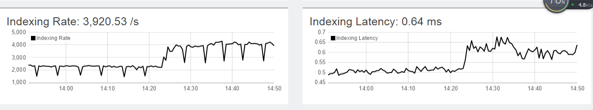

# 亿级日志系统搭建与调优

## 背景
APP服务端日志，一直都是分散在各个服务器本地，没有集中管理，对研发排错造成很大困扰。

一般情况下，拉勾APP的server是10+台。但在求职高峰季为了抗量机器会临时翻倍，如2017年3月的全民升职记期间app的服务器增加到22+台。

当用户访问出现问题时，就需要一台台去查询server的日志，不仅排查令研发人员苦不堪言，而且极大影响解决问题的速度。

## 预估与选型
因为项目的日志打印是log4j，而且为了避免每个server都部署beat和清理数据的瓶颈，考虑采用log4j直接打入kafka，再由logstash清理数据，最后打入ES。

### 预估
|条目|指标|
| --- | --- |
|单台server日志量|4G/天|
|server数|10台（+15台）|

#### 日志量
从上面数据可以，可以算出保留15天的日志，需要磁盘：4G*25*15 = 1500G。

#### 请求量
总请求量大约13万/分钟，也就是2200/s。

### 调研
|条目|指标|来源|
| --- | --- | --- |
| log4j1|写入30万/s|[参考](https://my.oschina.net/OutOfMemory/blog/789267)|
| log4j2 & logback|写入200万/s|[参考](https://logging.apache.org/log4j/2.x/performance.html)|
|logstash grok|解析速度2万/s|[参考](https://www.elastic.co/blog/do-you-grok-grok)|
|ES|写入1万/s||

**TODO：目前项目用的log4j1.7，后期会迁到logback。**

### 结论
就目前情况，仅使用logstash清理数据已完全够用。

**TIP：当logstash达到瓶颈时，再考虑升级到使用spark等清理数据的方式。**

## 搭建与调优
### 架构

### 版本
|组件|version|
| --- | --- |
|kafka|0.8.2.0|
|kibaka|4.6.4|
|logstash|2.3.4|
|elasticsearch|2.4.4|

### 配置
|组件|数量|
| --- | --- |
|logstash|三台|
|ES|三台|

### 坎坷调优
第一版搭建完，配置都是走的默认的，高高兴兴观察写入。

刚开始还是，写入正常，但跑了几个小时之后，logstash的work线程会dead，然后就停止写ES。

.png)

由于logstash 2.x是黑盒的，所以排查问题只能靠猜。

#### jvm
在`jmap -heap` 发现logstash的新生代才`几十M`。

再`jstat -gcutil `一下，发现gc太频繁，logstash堆内存默认最大是`1G`，果断上调到`4g`。同时将`新生代`设置成`2g`。

再观察`jstat`发现好多了，logstash速度也比较平稳，以为问题解决了，高高兴兴回家了。

同时，将ES堆内存调到`20G`。

#### kafka
##### consumer数
第二天，高高兴兴验证自己的劳动成果，傻了，kafka中日志消息积累了2千万条。

再google，有[文章](http://www.person168.com/?p=467)说，kafka 消费者数要和kafka 分区数相同，如果消费者数 `<` 分区数，可能触发kafka潜在漏洞。

然后一看kafka输入插件的`consumer_threads`默认是`1`，擦，改。因为是3台logstash，paul大神改成了 `7-7-7`，实际消费数据的是`7-7-6`，也就是说logstash003多开一个线程，有点浪费资源（一个线程，不值当改配置，想想也就忍了）。参考过[kafka分区和消费者负载的原理](https://www.safaribooksonline.com/library/view/kafka-the-definitive/9781491936153/ch04.html)。

##### exception
然后看zk和kafka日志，发现是不是有报错，查找发现是两一个项目使用有问题

追踪IP等，发现并解决掉。

观察了一会没问题，以为解决了，高高兴兴回家了。

### 升级logstash版本
第二天，高高兴兴验证自己的劳动成果，傻了，kafka中日志消息又积累了2千万条。

### logstash升级
这个时候，有点无奈了，因为logstash jvm正常，kafka也没问题，再次比对logstash-kafka-es的版本支持，发现logstash2.3.4也是支持0.8的kafka。开始怀疑人生。

去logstash的github上和es forum上去搜索相关问题，偶然间发现两篇文章：

- [logstash-input-beats blocked,lots of error output](https://github.com/elastic/logstash/issues/5333)
- [Logstash can’t talk to elasticsearch after several hours’ running](https://discuss.elastic.co/t/logstash-cant-talk-to-elasticsearch-after-several-hours-running/63198/5)

无奈之下，只好升级logstash版本。既然升就选择最好的，果断升到[logstash 2.4.1](https://www.elastic.co/downloads/past-releases/logstash-2-4-1)

将logstash升了一台，然后开了`20`个线程，去消费`20`个分区，就现在日志量，感觉一台也扛得住。因为是周五升级的，观察了一个周末发现没问题，高高兴兴睡觉。

### ES调优
周一上班，高高兴兴查日志，擦，kafka又堆积2千万日志，天呐，心好累。

不过，冷静一下，观察监控发现这次情况和之前不同，ES依然有写入，只是速度很慢，正常情况是2000+/s，现在是400/s左右，查看ES集群负载，发现003 jvm已98%，天呐，`ps`发现es内存忘记改了。

改完之后，在观察，因为堆积太多日志，所以logstash的Es很多就会达到阈值，也就是Es会有大量bulk写入请求。
但别人的Es都是1万+的写入，就是默认5s的刷新间隔不大，也不至于，这么慢。开始ES调优。

然后参考了几篇文章：
- [lasticsearch 基础理论 & 配置调优](http://tchuairen.blog.51cto.com/3848118/1861603)
- [玩儿透ELK日志分析集群搭建管理](http://benpaozhe.blog.51cto.com/10239098/1892388)
- [官方说明](https://www.elastic.co/guide/en/elasticsearch/guide/current/indexing-performance.html)
- [fieldData参数设置的注意点](https://kibana.logstash.es/content/elasticsearch/performance/fielddata.html)

**另外，** 之前用kibana查询日志时，很容易影响写入。所以这里引入一个重要配置`indices.fielddata.cache.size`，参数值参考[这里](https://www.elastic.co/guide/en/elasticsearch/guide/current/_limiting_memory_usage.html)。

**最诡异的是，** 3台ES只有master负载过`10`，其他两台基本没负载，读写相互影响，想了想ES肯定有解决方案，比如读写分离，一搜果然如此。发现两篇文章[Master和DataNode未分离，导致集群不稳定](http://www.jianshu.com/p/fa31f38d241e) 和[Elasticsearch集群的脑裂问题](http://www.sanwen8.com/p/1g67vmdo.html)。

### ES Node
master node、data node、client node都是什么鬼，参考[这里](https://www.elastic.co/guide/en/elasticsearch/reference/2.4/modules-node.html)。

这种不稳定，不仅不稳定实在不能忍，果断调整ES节点角色，因为目前是三台Es，调整成一台master去维护元数据和处理请求，两台专做data节点。

同时，上调了 logstash的`-b 100`，增大logstash吞吐量。

最后，让logstash处理验证效果，先启一台logstash，不错，平稳维持在`2000+/s`，再启一台logstash，写入上升到`4000+/s`，perfect。

再看ES负载，预期效果。

分分种种，消费完4千万，完善日志格式，上线，消费平稳，查询稳定，高高兴兴回家。

第二天，上班观察，kafka终于无堆积了，写入速度也`1700+/s`左右。

**完美。**
### 最终版本
|组件|version|
| --- | --- |
|kafka|0.8.2.0|
|kibaka|4.6.4|
|logstash|2.4.1|
|elasticsearch|2.4.4|

### 最终架构
最终ES节点架构：一台client、两台Master、三台Data。

