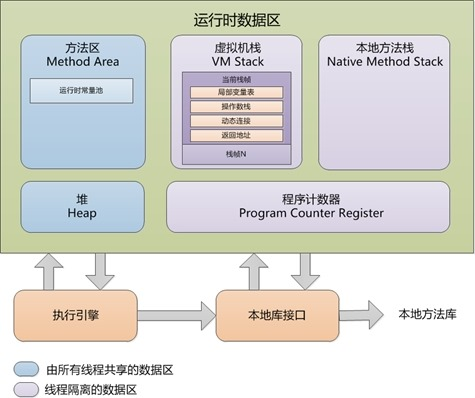

# JVM运行时数据区和几种内存溢出的问题

数据区各部分说明，其中方法区和堆是所有工作线程共享的，而栈、程序计数器和本地方法栈是线程私有的。

如下图，



## 数据区的划分
### 1、程序计数器

程序计数器（Program Counter Register）是一块比较小的内存空间，它可以看作是当前线程所执行的字节码的行号指示器；
PCR为线程私有内存，程序计数器是唯一一个在Java虚拟机规范中没有规定任何OOM情况的区域。

内存溢出：不会发生

### 2、虚拟机栈
由栈帧组成、每个栈帧代表一次方法调用，其包含存储变量表、操作数栈和方法出口三个部分，方法执行完成后该栈帧将被弹出。

内存溢出：StackOverflowError和OutOfMemoryError。

溢出原因：

StackOverflowError：如果请求的栈的深度大于虚拟机所允许的深度，将会抛出这个异常，如果使用虚拟机默认参数，一般达到1000到2000这样的深度没有问题。
OutOfMemoryError：因为除掉堆内存和方法区容量，剩下的内存由虚拟机栈和本地方法栈瓜分，如果剩下的内存不足以满足更多的工作线程的运行、或者不足以拓展虚拟机栈的时候，就会抛出OutOfMemoryError异常。

解决方法：

针对StackOverflowError：

1. 首先栈溢出会输出异常信息，根据信息查看对应的方法调用是否出现无限调用、或者栈帧过大等代码逻辑上的问题，通过修改代码逻辑解决；
2. 如果确确实实需要更大的栈容量，可以检查并调大栈容量：-Xss16m。

针对OutOfMemoryError：

1. 首先检查是否创建过多的线程，减少线程数
2. 可以通过“减少最大堆容量”或“减少栈容量”来解决。

### 3、本地方法栈
与虚拟机栈唯一的不同是虚拟机栈执行的是java方法，而本地方法栈执行的是本地的C/C++方法

内存溢出：StackOverflowError和OutOfMemoryError

溢出原因：同虚拟机栈

解决方法：同虚拟机栈

### 4、堆
所有线程共享，存放对象实例

内存溢出：OutOfMemoryError:Java heap space

溢出原因：堆中没有足够内存完成实例分配，并且无法继续拓展时

解决方法：

1. 内存泄露检查：首先通过“内存溢出快照 + MAT等分析工具”，分析是否存在内存泄露现象，检查时可以怀疑的点比如集合、第三方库如数据库连接的使用、new关键字相关等。
2. 如果没有内存泄露，那么就是内存溢出，所有对象却是都还需要存活，这个时候就只能调大堆内存了：-Xms和-Xmx。

### 5、方法区
所有线程共享，存放已加载的class信息、常量、静态变量和即时编译后的代码

内存溢出：OutOfMemoryError:PermGen space

溢出原因：方法区没有足够内存完成内存分配存放运行时新加载的class信息

解决方法：

1. 内存泄露检查：检查是否加载过多class文件(jar文件)，或者重复加载相同的class文件(jar文件)多次
2. 通过-XX:PermSize=64M -XX:MaxPermSize=128M改大方法区大小

### 6、运行时常量池
方法区的一部分，存放常量

内存溢出：OutOfMemoryError:PermGen space

溢出原因：方法区没有足够的内存完成内存分配，存放运行时新创建的常量，比如String类的intern()方法，其作用是如果常量池已经包含一个相同的字符串，则返回其引用，否则将此String对象包含的字符串添加到常量池中。

解决方法：

1. 内存泄露检查：检查是否创建过多常量
2. 通过-XX:PermSize=64M -XX:MaxPermSize=128M改大方法区大小

### 7、直接内存
不属于JVM运行时数据区，也不是虚拟机规范中定义的内存区域，JDK1.4引入的NIO中包含通道Channel和缓冲区Buffer，应用程序从通道获取数据是先经过OS的内核缓冲区，再拷贝至Buffer，因为比较耗时，所以Buffer提供了一种直接操作操作系统缓冲区的方式，即ByteBuffer.allocateDirector(size)，这个方法返回DirectByteBuffer应用就是指向这个底层存储空间关联的缓冲区，即直接内存(native memory)，或者叫堆外内存。

内存溢出：OutOfMemoryError

溢出原因：JVM所需内存 + 直接内存 > 机器物理内存(或操作系统级限制)，无法动态拓展

判断方法：内存泄露检查：例如内存占用较高，机器性能骤降，但是通过GC信息或者jstat发现GC很少，通过jmap获得快照分析后也没发现什么异常，而程序中又直接或者间接地用到了NIO，那么和可能就是直接内存泄露了。

解决方法：分析NIO相关的程序逻辑解决。

参考[这里](http://blog.csdn.net/jiyiqinlovexx/article/details/51171452)

> JVM中是否存在不会发生内存溢出的区域？

> 答：存在。**程序计数器** 是 **唯一** 一个在Java虚拟机规范中没有规定任何OOM（即不存在内存溢出）情况的区域。

## Java JVM：内存溢出（栈溢出，堆溢出等4种溢出）

### 栈溢出(StackOverflowError)

栈溢出抛出StackOverflowError错误，也属于内存溢出， 出现此种情况是`因为方法运行的时候栈的深度超过了虚拟机容许的最大深度所致`。 出现这种情况，一般情况下是程序错误所致的，比如写了一个死递归，就有可能造成此种情况。

实例代码如下，

```java
package com.jimi.java._interview.jvm;

/**
 * Created by lagou on 2017/3/7.
 */
public class SOFETest {

    /**
     * 无限递归方法
     */
    public void stackOverFlowMethod() {
        stackOverFlowMethod();
    }

    public static void main(String[] args) {
        SOFETest sofeTest = new SOFETest();
        sofeTest.stackOverFlowMethod();
    }
}
```

异常

```java
Exception in thread "main" java.lang.StackOverflowError
	at com.jimi.java._interview.jvm.SOFETest.stackOverFlowMethod(SOFETest.java:9)
	at com.jimi.java._interview.jvm.SOFETest.stackOverFlowMethod(SOFETest.java:9)
	at com.jimi.java._interview.jvm.SOFETest.stackOverFlowMethod(SOFETest.java:9)
	...
	at com.jimi.java._interview.jvm.SOFETest.stackOverFlowMethod(SOFETest.java:9)

Process finished with exit code 1
```

注：出现StackOverflowError异常时，有错误堆栈信息可以阅读，比较容易找到问题的所在。

**如果使用虚拟机默认参数，栈深度在大多数情况下达到1000-2000完全没有问题，对于正常的方法调用（包括递归），这个深度应该完全够用了。但是，如果是建立过多线程导致的OutOfMemoryError异常，在不能减少线程数或者更换64位虚拟机的情况下，就只能通过减少最大堆和减少栈容量来换取更多的线程。**

### 堆溢出(OutOfMemoryError:java heap space)
Java堆内存的OOM是实际应用中最常见的内存溢出异常情况。出现Java堆内存溢出时，异常堆栈信息“java.lang.OutOfMemoryError”会跟着进一步提示“Java Heap space”。

要解决这个区域的异常，一般是首先通过内存映像分析工具（如Eclipse Memory Analyzer）对dump出来的堆转储快照进行分析，重点是确认内存中的对象是否是必要的，也就是要先分清楚到底是出现了内存泄漏（Memory Leak）还是内存溢出（Memory Overflow）。

- 内存泄漏

    可进一步用通过工具查看泄漏对象到GC Roots的引用链。就能找到泄漏对象是通过怎样的路径与GC Roots相关联并导致垃圾收集器无法自动回收它们的。掌握了泄漏对象的类型信息，以及GC Roots引用链的信息，就可以比较准确地定位出泄漏代码的位置。

- 内存溢出

    检查虚拟机的对参数（-Xmx和-Xms），与机器物理内存对比看是否还可以调大，从代码上检查是否存在某些对象生命周期过长、持有状态时间过长的情况，尝试减少程序运行期的内存消耗。

实例代码如下，

```java
import java.util.*;
import java.lang.*;
public class OOMTest{
        public static void main(String... args){
                List<byte[]> buffer = new ArrayList<byte[]>();
                //申请10M堆空间
                buffer.add(new byte[10*1024*1024]);
        }
}
```

通过如下的命令运行上面的代码，

```
java -verbose:gc -Xmn10M -Xms20M -Xmx20M -XX:+PrintGCOOMTest
```

执行结果，

```
[GC 1180K->366K(19456K), 0.0037311 secs]
[Full GC 366K->330K(19456K), 0.0098740 secs]
[Full GC 330K->292K(19456K), 0.0090244 secs]
Exception in thread "main" java.lang.OutOfMemoryError: Java heap space
        at OOMTest.main(OOMTest.java:7)
 ```

### 关键点
>1、堆内存明明是20M，为什么会发生内存溢出？

答：-Xms和-Xmx是设置初始堆和最大堆的大小都是20M，-Xmn是设置年轻代大小为10M。
而JVM堆内存大小=年轻代+年老代大小+持久代大小。所以上述命令下，年老代内存不到10M。

jvm参数作用，参考[2、jvm参数说明及调优.md](2、jvm参数说明及调优.md)。

>2、通过上面的实验其实也从侧面验证了一个结论

当对象大于新生代剩余内存的时候，将直接放入老年代，当老年代剩余内存还是无法放下的时候，触发垃圾收集，收集后还是不能放下就会抛出内存溢出异常了。

jvm垃圾回收算法，参考[3、jvm内存模型及垃圾回收算法.md](3、jvm内存模型及垃圾回收算法.md)

### 持久代溢出(OutOfMemoryError: PermGen space)
Hotspot jvm通过持久代实现了Java虚拟机规范中的方法区，而运行时的常量池就是保存在方法区中的，因此持久带溢出有可能是运行时常量池溢出，也有可能是方法区中保存的class对象没有被及时回收掉或者class信息占用的内存超过了我们配置。 当持久带溢出的时候抛出java.lang.OutOfMemoryError: PermGen space。

可能在如下几种场景下出现，

1. 使用一些应用服务器的热部署的时候，我们就会遇到热部署几次以后发现内存溢出了，这种情况就是因为每次热部署的后，原来的class没有被卸载掉。

2. 如果应用程序本身比较大，涉及的类库比较多，但是我们分配给持久带的内存（通过-XX:PermSize和-XX:MaxPermSize来设置）比较小的时候也可能出现此种问题。

3. 一些第三方框架，比如spring,hibernate都通过字节码生成技术（比如CGLib）来实现一些增强的功能，这种情况可能需要更大的方法区来存储动态生成的Class文件。

Java中字符串常量是放在常量池中的，而String.intern()这个方法运行的时候，会检查常量池中是否存和本字符串相等的对象，如果存在直接返回对常量池中对象的引用，不存在的话，先把此字符串加入常量池，然后再返回字符串的引用。那么我们就可以通过String.intern方法来模拟一下运行时常量区的溢出。

实例代码如下，

```java
import java.util.*;
import java.lang.*;
public class OOMTest{
        public static void main(String... args){
                List<String> list = new ArrayList<String>();
                while(true){
                      list.add(UUID.randomUUID().toString().intern());
                }
        }
}
```

通过如下的命令运行上面代码，

```
java -verbose:gc -Xmn5M -Xms10M -Xmx10M -XX:MaxPermSize=1M -XX:+PrintGC OOMTest
```

运行结果如下，

```
Exception in thread "main" java.lang.OutOfMemoryError: PermGen space
        at java.lang.String.intern(Native Method)
        at OOMTest.main(OOMTest.java:8)
```

### OutOfMemoryError:unable to create native thread
java.lang.OutOfMemoryError:unable to create natvie thread这种错误，出现这种情况的时候，一般是下面两种情况导致的：

1. 程序创建的线程数超过了操作系统的限制。对于Linux系统，我们可以通过ulimit -u来查看此限制。

2. 给虚拟机分配的内存过大，导致创建线程的时候需要的native内存太少。

操作系统对每个进程的内存是有限制的，我们启动Jvm,相当于启动了一个进程，假如我们一个进程占用了4G的内存，那么通过下面的公式计算出来的剩余内存就是建立线程栈的时候可以用的内存。

 > 线程栈总可用内存=4G-（-Xmx的值）- （-XX:MaxPermSize的值）- 程序计数器占用的内存

 通过上面的公式我们可以看出，-Xmx 和 MaxPermSize的值越大，那么留给线程栈可用的空间就越小，在-Xss参数配置的栈容量不变的情况下，可以创建的线程数也就越小。

 因此如果是因为这种情况导致的unable to create native thread,那么要么我们增大进程所占用的总内存，或者减少-Xmx或者-Xss来达到创建更多线程的目的。

 参考[Java JVM：内存溢出（栈溢出，堆溢出等4种溢出）](http://www.tuicool.com/articles/EviAnmF)