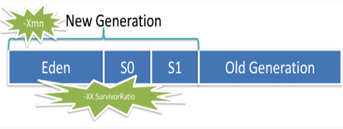
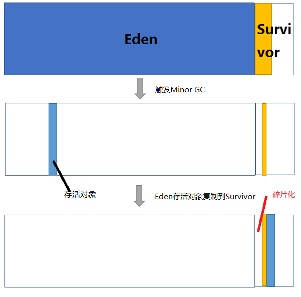
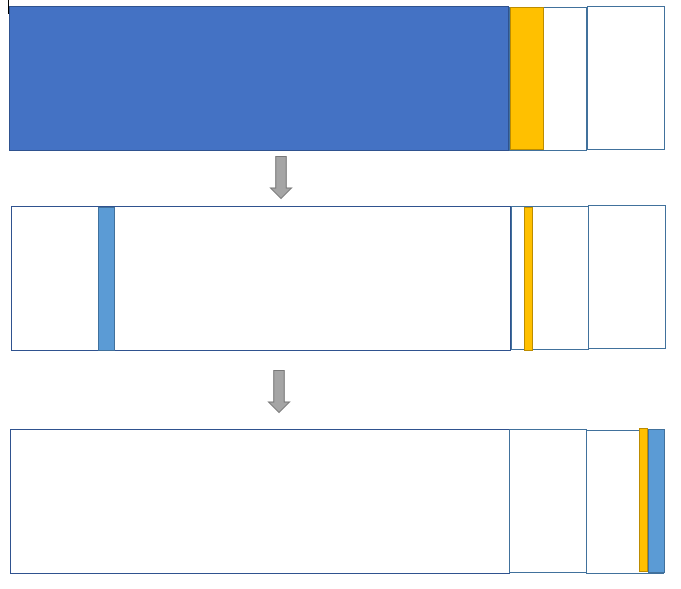

# jvm内存模型及垃圾回收算法

Jvm(Java虚拟机)主要管理两种类型内存：堆和非堆。

- 堆

    是运行时数据区域，所有类实例和数组的内存均从此处分配。
- 非堆

    是JVM留给自己用的，包含方法区、JVM内部处理或优化所需的内存（如 JIT Compiler，Just-in-time Compiler，即时编译后的代码缓存）、每个类结构（如运行时常数池、字段和方法数据）以及方法和构造方法的代码。

简言之，Java程序内存主要（这里强调主要二字）分两部分，堆和非堆。大家一般new的对象和数组都是在堆中的，而GC主要回收的内存也是这块堆内存。

## 堆内存模型

- 堆内存由垃圾回收器的自动内存管理系统回收。

- 堆内存分为两大部分：新生代和老年代。比例为1：2。

- 老年代主要存放应用程序中生命周期长的存活对象。

- 新生代又分为三个部分：一个Eden区和两个Survivor区，比例为8：1：1。

    Eden区存放新生的对象。

    Survivor存放每次垃圾回收后存活的对象。

如图，

### 几个问题
#### 为什么要有Survivor区？
如果没有Survivor，Eden区每进行一次Minor GC，存活的对象就会被送到老年代。老年代很快被填满，触发Major GC（因为Major GC一般伴随着Minor GC，也可以看做触发了Full GC）。老年代的内存空间远大于新生代，进行一次Full GC消耗的时间比Minor GC长得多。

你也许会问，执行时间长有什么坏处？频发的Full GC消耗的时间是非常可观的，这一点会影响大型程序的执行和响应速度，更不要说某些连接会因为超时发生连接错误了。

**所以，Survivor的存在意义，就是减少被送到老年代的对象，进而减少Full GC的发生，Survivor的预筛选保证，只有经历 16次 Minor GC还能在新生代中存活的对象，才会被送到老年代。**

#### 为什么不是一块Survivor空间而是两块？
为什么一个Survivor区不行？第一部分中，我们知道了必须设置Survivor区。假设现在只有一个survivor区，我们来模拟一下流程：
刚刚新建的对象在Eden中，一旦Eden满了，触发一次Minor GC，Eden中的存活对象就会被移动到Survivor区。这样继续循环下去，下一次Eden满了的时候，问题来了，此时进行Minor GC，Eden和Survivor各有一些存活对象，如果此时把Eden区的存活对象硬放到Survivor区，很明显这两部分对象所占有的内存是不连续的，也就导致了内存碎片化。

如下图，

**所以，设置两个Survivor区最大的好处就是解决了碎片化。**

> 碎片化带来的风险是极大的，严重影响Java程序的性能。堆空间被散布的对象占据不连续的内存，最直接的结果就是，堆中没有足够大的连续内存空间，接下去如果程序需要给一个内存需求很大的对象分配内存。

那么，顺理成章的，应该建立两块Survivor区，刚刚新建的对象在Eden中，经历一次Minor GC，Eden中的存活对象就会被移动到第一块survivor space S0，Eden被清空；等Eden区再满了，就再触发一次Minor GC，Eden和S0中的存活对象又会被复制送入第二块survivor space S1（这个过程非常重要，因为这种复制算法保证了S1中来自S0和Eden两部分的存活对象占用连续的内存空间，避免了碎片化的发生）。S0和Eden被清空，然后下一轮S0与S1交换角色，如此循环往复。如果对象的复制次数达到16次，该对象就会被送到老年代中。

如下图，

#### 为什么Eden空间这么大而Survivor空间要分的少一点？
新创建的对象都是放在Eden空间，这是很频繁的，尤其是大量的局部变量产生的临时对象，这些对象绝大部分都应该马上被回收，能存活下来被转移到survivor空间的往往不多。所以，设置较大的Eden空间和较小的Survivor空间是合理的，大大提高了内存的使用率，缓解了Copying算法的缺点。

我看8：1：1就挺好的，当然这个比例是可以调整的，包括上面的新生代和老年代的1：2的比例也是可以调整的。

**注：从Eden空间往Survivor空间转移的时候Survivor空间不够了，会直接放到老年代去。**

### 一个class要被回收准确的说应该是卸载，必须同时满足以下三个条件

- 堆中不存在该类的任何实例
- 加载该类的classloader已经被回收
- 该类的java.lang.Class对象没有在任何地方被引用，也就是说无法通过反射再带访问该类的信息

### Java对象是否可回收的判定算法

- 引用计数算法

    给对象中添加一个引用计数器，每当有一个地方引用它时，计数器值就加1；当引用失效时，计数器值就减1；任何时刻计数器为0的对象就是不可能再被使用的。

- 根搜索算法（可达性分析算法）

    它把内存中的每一个对象都看作一个节点，并且定义了一些对象作为根节点“GC Roots”。从GC roots作为起点 ，也就是根对象，如果从一个对象没有到达根对象的路径，或者说从根对象开始无法引用到该对象，该对象就是不可达的，否则，就是可达对象。

    这是不可达对象，就是需要被回收的。

> 那什么样的对象才可以做GC Roots对象？

#### 四类可作为GC Roots对象的情况

1. 虚拟机栈中的引用的对象

    我们在程序中正常创建一个对象，对象会在堆上开辟一块空间，同时会将这块空间的地址作为引用保存到虚拟机栈中，如果对象生命周期结束了，那么引用就会从虚拟机栈中出栈，因此如果在虚拟机栈中有引用，就说明这个对象还是有用的，**这种情况是最常见的**。

2. 我们在类中定义了全局的静态的对象

    也就是使用了static关键字，由于虚拟机栈是线程私有的，所以这种对象的引用会保存在共有的方法区中，显然将 **方法区中的静态引用**作为GC Roots是必须的。

3. 常量引用

    就是使用了static final关键字，由于这种引用初始化之后不会修改，所以 **方法区常量池**里的引用的对象也应该作为GC Roots。

4. 本地方法栈中引用的对象

    使用JNI技术时，有时候单纯的Java代码并不能满足我们的需求，我们可能需要在Java中调用C或C++的代码，因此会使用native方法，JVM内存中专门有一块本地方法栈，用来保存这些对象的引用，所以本地方法栈中引用的对象也会被作为GC Roots。

参考[这里](http://blog.csdn.net/u011277123/article/details/53908315)

### 垃圾回收算法

- **标记清除**算法 (Mark-Sweep)

    标记-清除算法分为两个阶段：标记阶段和清除阶段。标记阶段的任务是标记出所有需要被回收的对象，清除阶段就是回收被标记的对象所占用的空间。

    **其中，标记阶段就是采用根搜索算法，找到所有的GC Roots结点，将他们放到队列里，然后依次递归的遍历所有的根结点以及引用的所有子节点，将所有遍历到的结点标记为live**。

    **优点：** 简单，容易实现。

    **缺点：** 容易产生内存碎片。

- 复制算法 (Copying)

    复制算法将可用内存按容量划分为大小相等的两块，每次只使用其中的一块。当这一块的内存用完了，就将还存活着的对象复制到另外一块上面，然后再把已使用的内存空间一次清理掉。

    **优点：** 实现简单，不容易产生内存碎片。

    **缺点：**

     - 对内存空间使用做出了高昂的代价。
     - 复制算法的效率跟存活对象数量有很大的关系，如果存活对象很多，那么复制算法的效率会大大降低。

- **标记整理**算法 (Mark-Compact)

    该算法标记阶段和Mark-Sweep一样，但是在完成标记之后，它不是直接清理可回收对象，而是将存活对象都向一端移动，然后清理掉端边界以外的内存。

    **优点：** 实现简单，不容易产生内存碎片。

    **缺点：**

    标记整理算法跟回收对象数量有很大的关系，如果回收对象很多，那么标记整理算法的效率大大降低。

    **可以看出复制算法和标记整理算法有点针对标记消除算法的缺点而诞生的。**

- 分代回收算法

    分代回收算法其实不算一种新的算法，而是根据复制算法和标记整理算法的的特点综合而成。这种综合是考虑到java的语言特性的。

    我们根据对象存活的生命周期将内存划分为若干个不同的区域。一般情况下将堆区划分为老年代（Old Generation）和新生代（Young Generation）。新生代的特点是每次垃圾回收时都有大量的对象需要被回收，所以对新生代使用复制算法；老年代的特点是每次垃圾收集时只有少量对象需要被回收， 所以对老年代使用 **标记整理**算法。

    > 复制算法：适用于存活对象很少。回收对象多。

    > 标记整理算法: 适用用于存活对象多，回收对象少。

### 垃圾回收器

1. Serial

    收集器曾经是虚拟机新生代收集的唯一选择，是一个单线程的收集器，在进行收集垃圾时，必须stop the world，它是虚拟机运行在Client模式下的默认新生代收集器。

2. Serial Old

    是Serial收集器的老年代版本，同样是单线程收集器，使用 **标记整理**算法。

3. ParNew收集器

    是Serial收集器的多线程版本，许多运行在Server模式下的虚拟机中首选的新生代收集器，除Serial外，只有它能与CMS收集器配合工作。

4. Parallel Scavenge收集器

    同ParNew回收器一样， 不同的地方在于，它非常关注系统的吞吐量(通过参数控制) 。

    它的目标是达到一个可控制的运行用户代码跟（运行用户代码+垃圾收集时间）的百分比值。

5. Parallel Old收集器

    是Parallel Scavenge收集器的老年代版本，使用多线程和 **标记整理**算法。

6. Concurrent Mark Sweep 收集器

    是一种以获得最短回收停顿时间为目标的收集器，基于 **标记清除**算法。

    过程如下：初始标记，并发标记，重新标记，并发清除，优点是并发收集，低停顿，缺点是对CPU资源非常敏感，无法处理浮动垃圾，收集结束会产生大量空间碎片。

7. G1收集器

    是基于 **标记整理**算法实现的，不会产生空间碎片，可以精确地控制停顿，将堆划分为多个大小固定的独立区域，并跟踪这些区域的垃圾堆积程度，在后台维护一个优先列表，每次根据允许的收集时间，优先回收垃圾最多的区域（Garbage First）。

# 附录
## Object中finalize()、System.gc()和Runtime.getRuntime().gc()的区别？这几种方式会不会立即触发GC工作？

- Finalizer

    Finalizer则由另一个独立（高优先级CLR)线程来执行Finalizer的对象的内存回收。

    _对象的Finalizer被执行的时间是在对象不再被引用后的某个不确定的时间_，并非和C++中一样在对象超出生命周期时立即执行析构函数。

    GC把每一个需要执行Finalizer的对象放到一个队列(从终结列表移至freachable队列）中去，然后启动另一个线程而不是在GC执行的线程来执行所有这些Finalizer，GC线程继续去删除其他待回收的对象。

    在下一个GC周期，这些执行完Finalizer的对象的内存才会被回收。也就是说一个实现了Finalize方法的对象必需等两次GC才能被完全释放。这也表明 _有Finalize的方法（Object默认的不算）的对象会在GC中自动“延长”生存周期_。

    **特别注意：负责调用Finalize的线程并不保证各个对象的Finalize的调用顺序，这可能会带来微妙的依赖性问题。**

- System.gc()和Runtime.getRuntime().gc()

    两者作用相同，System.gc内部就是调用的Runtime.getRuntime().gc()。

    程序员可以手动执行System.gc()，通知GC运行，但是Java语言规范并不保证GC一定会执行。只是 **建议**JVM安排GC运行, 还有可能完全被拒绝。