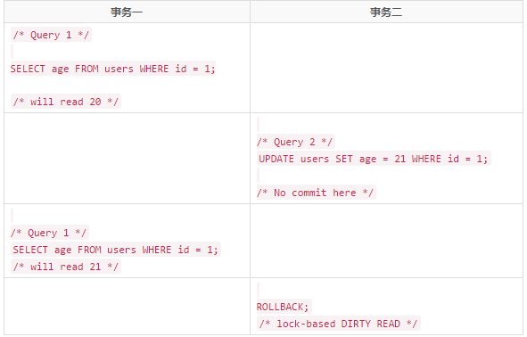
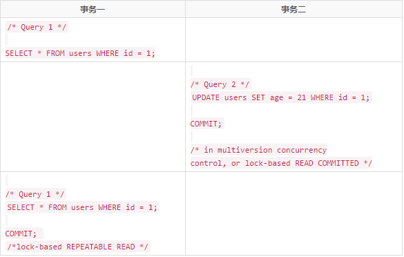
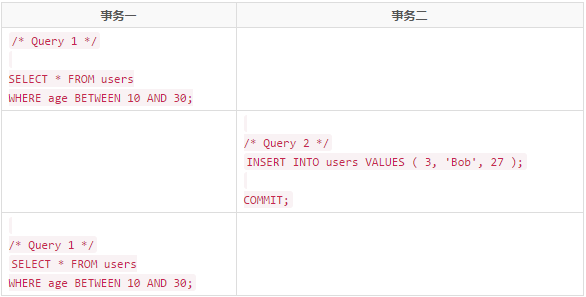

## 事务和隔离级别介绍

### 定义
事务保证了一个操作序列可以全部都执行或者全部都不执行（原子性），从一个状态转变到另外一个状态（一致性）。由于事务满足持久性。所以一旦事务被提交之后，数据就能够被持久化下来，又因为事务是满足隔离性的，所以，当多个事务同时处理同一个数据的时候，多个事务之间是相互隔离的状态，也就是说，在多个事务并发操作的过程中，如果控制不好隔离级别，就有可能产生脏读、不可重复读或者幻读等读现象。

### 三种读现象
脏读就是一个事务读取到另一个事务处理中且后来又被撤销的数据。
不可重复读就是一个事务读完，再次读取时数据却被另一个事务修改的数据。

- 脏读

    脏读又称无效数据的读出，是指在数据库访问中，事务T1将某一值修改，然后事务T2读取该值，此后T1因为某种原因撤销对该值的修改，这就导致了T2所读取到的数据是无效的。

    也就是说，当一个事务正在访问数据，并且对数据进行了修改，而这种修改还没有提交(commit)到数据库中，这时，另外一个事务（T2）也访问这个数据，然后使用了这个数据。因为这个数据是还没有提交的数据，那么另外一个事务（T2）读到的这个数据是脏数据。

    注： **未提交读** 会导致 **脏读**。

- 不可重复读

    在一个事务内（T1），多次读同一个数据。在这个事务（T1）还没有结束时，另一个事务也访问该同一数据。那么，在第一个事务（T1）的两次读数据之间。由于第二个事务的修改，那么第一个事务（T1）读到的数据可能不一样，这样就发生了在一个事务（T1）内两次读到的数据是不一样的，因此称为不可重复读。

    注： **提交读** 可以解决 **脏读**，但会导致 **不可重复读**。
    
- 幻读

    幻读是指当事务不是独立执行时发生的一种现象，例如第一个事务对一个表中的数据进行了修改，比如这种修改涉及到表中的“全部数据行”。同时，第二个事务也修改这个表中的数据，这种修改是向表中插入“一行新数据”。那么，以后就会发生操作第一个事务的用户发现表中还有没有修改的数据行，就好象发生了幻觉一样。

    注： **可重复读** 可以解决不可重复读，但会导致 **幻读**。

    **一般解决幻读的方法是增加范围锁RangeS，锁定检锁范围为只读，这样就避免了幻读。**

>各隔离级别，在并发事务中是如何加锁的？

>参下面，四种隔离级别。

### 四种隔离级别及加锁方式
事务中共四种隔离级别，隔离级别从低到高如下，

- 未提交读（READ-UNCOMMITTED）
- 提交读（READ-COMMITTED）
- 可重复读（REPEATABLE-READ）
- 序列化（SERIALIZABLE）

#### 未提交读

1. 加锁原理

>事务在读数据的时候并未对数据加锁。

>事务在修改数据的时候只对数据增加行级共享锁。

2. 现象

>事务1读取某行记录时，事务2也能对这行记录进行读取、更新（因为事务一并未对数据增加任何锁）。

>当事务2对该记录进行更新时，事务1再次读取该记录，能读到事务2对该记录的修改版本（因为事务二只增加了共享读锁，事务一可以再增加共享读锁读取数据），即使该修改尚未被提交。
 事务1更新某行记录时，事务2不能对这行记录做更新，直到事务1结束（因为事务一对数据增加了共享读锁，事务二不能增加排他写锁进行数据的修改）。
 
3. 举例



事务一共查询了两次，在两次查询的过程中，事务二对数据进行了修改，并未提交（commit）。但是事务一的第二次查询查到了事务二的修改结果。在数据库的读现象浅析中我们介绍过，这种现象我们称之为脏读。

#### 提交读

1. 加锁原理

>事务对当前被读取的数据加 行级共享锁（当读到时才加锁），一旦读完该行，立即释放该行级共享锁；

>事务在更新某数据的瞬间（就是发生更新的瞬间），必须先对其加 行级排他锁，直到事务结束才释放。

2. 现象

>事务1在读取某行记录的整个过程中，事务2都可以对该行记录进行读取（因为事务一对该行记录增加行级共享锁的情况下，事务二同样可以对该数据增加共享锁来读数据。）。

>事务1读取某行的一瞬间，事务2不能修改该行数据，但是，只要事务1读取完改行数据，事务2就可以对该行数据进行修改。（事务一在读取的一瞬间会对数据增加共享锁，任何其他事务都不能对该行数据增加排他锁。但是事务一只要读完该行数据，就会释放行级共享锁，一旦锁释放，事务二就可以对数据增加排他锁并修改数据）。
 事务1更新某行记录时，事务2不能对这行记录做更新，直到事务1结束。（事务一在更新数据的时候，会对该行数据增加排他锁，知道事务结束才会释放锁，所以，在事务二没有提交之前，事务一都能不对数据增加共享锁进行数据的读取。所以，提交读可以解决脏读的现象）

3. 举例

 

在提交读隔离级别中，在事务二提交之前，事务一不能读取数据。只有在事务二提交之后，事务一才能读数据。
但是从上面的例子中我们也看到，事务一两次读取的结果并不一致，所以提交读不能解决不可重复读的读现象。

简而言之，提交读这种隔离级别保证了读到的任何数据都是提交的数据，避免了脏读(dirty reads)。但是不保证事务重新读的时候能读到相同的数据，因为在每次数据读完之后其他事务可以修改刚才读到的数据。

#### 可重复读

1. 加锁原理

>事务在读取某数据的瞬间（就是开始读取的瞬间），必须先对其加 行级共享锁，直到事务结束才释放；

>事务在更新某数据的瞬间（就是发生更新的瞬间），必须先对其加 行级排他锁，直到事务结束才释放。

2. 现象

>事务1在读取某行记录的整个过程中，事务2都可以对该行记录进行读取（因为事务一对该行记录增加行级共享锁的情况下，事务二同样可以对该数据增加共享锁来读数据。）。

>事务1在读取某行记录的整个过程中，事务2都不能修改该行数据（事务一在读取的整个过程会对数据增加共享锁，直到事务提交才会释放锁，所以整个过程中，任何其他事务都不能对该行数据增加排他锁。所以，可重复读能够解决不可重复读的读现象）
 事务1更新某行记录时，事务2不能对这行记录做更新，直到事务1结束。（事务一在更新数据的时候，会对该行数据增加排他锁，知道事务结束才会释放锁，所以，在事务二没有提交之前，事务一都能不对数据增加共享锁进行数据的读取。所以，提交读可以解决脏读的现象）

3. 举例



1. 事务一的第一次查询条件是age BETWEEN 10 AND 30;如果这是有十条记录符合条件。这时，他会给符合条件的这十条记录增加行级共享锁。任何其他事务无法更改这十条记录。
2. 事务二执行一条sql语句，语句的内容是向表中插入一条数据。因为此时没有任何事务对表增加表级锁，所以，该操作可以顺利执行。
3. 事务一再次执行SELECT * FROM users WHERE age BETWEEN 10 AND 30;时，结果返回的记录变成了十一条，比刚刚增加了一条，增加的这条正是事务二刚刚插入的那条。
所以，事务一的两次范围查询结果并不相同。这也就是我们提到的幻读。

#### 可序列化

1. 加锁原理

>事务在读取数据时，必须先对其加 表级共享锁 ，直到事务结束才释放；

>事务在更新数据时，必须先对其加 表级排他锁 ，直到事务结束才释放。

2. 现象

>事务1正在读取A表中的记录时，则事务2也能读取A表，但不能对A表做更新、新增、删除，直到事务1结束。(因为事务一对表增加了表级共享锁，其他事务只能增加共享锁读取数据，不能进行其他任何操作）

>事务1正在更新A表中的记录时，则事务2不能读取A表的任意记录，更不可能对A表做更新、新增、删除，直到事务1结束。（事务一对表增加了表级排他锁，其他事务不能对表增加共享锁或排他锁，也就无法进行任何操作）

虽然可序列化解决了脏读、不可重复读、幻读等读现象。但是序列化事务会产生以下效果：

- 无法读取其它事务已修改但未提交的记录。
- 在当前事务完成之前，其它事务不能修改目前事务已读取的记录。
- 在当前事务完成之前，其它事务所插入的新记录，其索引键值不能在当前事务的任何语句所读取的索引键范围中。


### MySQL中操作隔离级别方式
InnoDB默认隔离级别是可重复读（REPEATABLE READ），InnoDB的可重复读隔离级别和其他数据库的可重复读是有区别的，使用GAP锁做到不会造成幻读（phantom read）。

参考[美团-Innodb中的事务隔离级别和锁的关系](http://tech.meituan.com/innodb-lock.html)

查询和修改方式，如下，
  
```mysql
-- 查看InnoDB系统级别的事务隔离级别
SELECT @@global.tx_isolation;

-- 查看InnoDB会话级别的事务隔离级别
select @@tx_isolation;  


-- 修改系统级别的事务隔离级别
set global transaction isolation level read committed;

-- 修改会话级别的事务隔离级别
set session transaction isolation level read committed;
```


